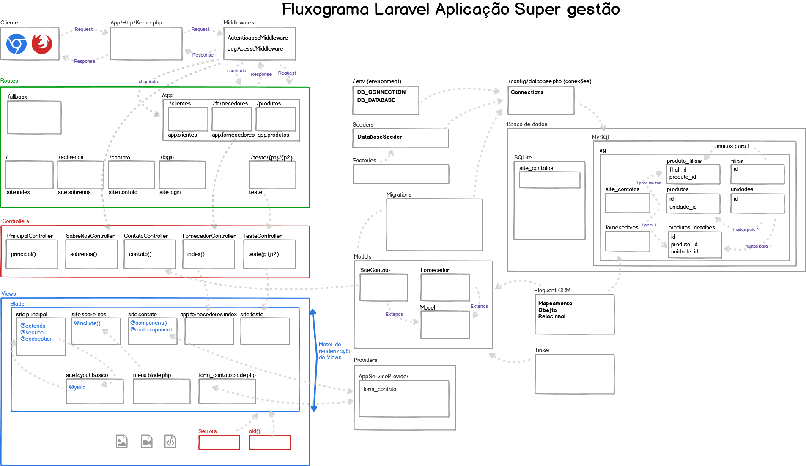

# 
App Super Gestão

:heavy_exclamation_mark: Projeto ainda em fase de desenvolvimento :exclamation:

Projeto feito com:
 - Laravel + MySQL 

O Intuito do projeto é criar uma aplicação web para gestão de produtos e fornecedores.
___

# Fluxograma do projeto
Agora será mostrado o fluxograma geral da aplicação.

&nbsp;

# Imagens da Aplicação
Agora será mostrado como está o projeto no momento.

### Layout inicial do projeto

&nbsp;

### Instalação
- Clone este repositorio atráves do terminal, VS Code 

## Autor

> William Silva -> [Site e portfolio pessoal](https://bywilliams.github.io/portfolio/)

**Agradeço por terem acompanhdo a documentação e a explicação deste pequeno projeto, e trarei mais projetos.**
